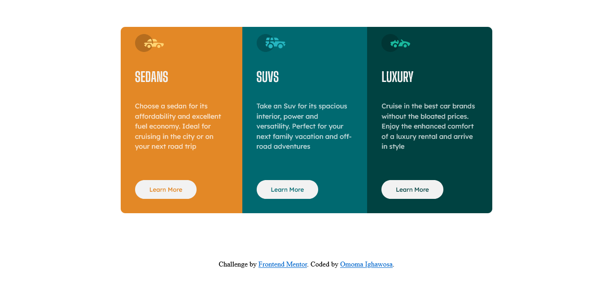
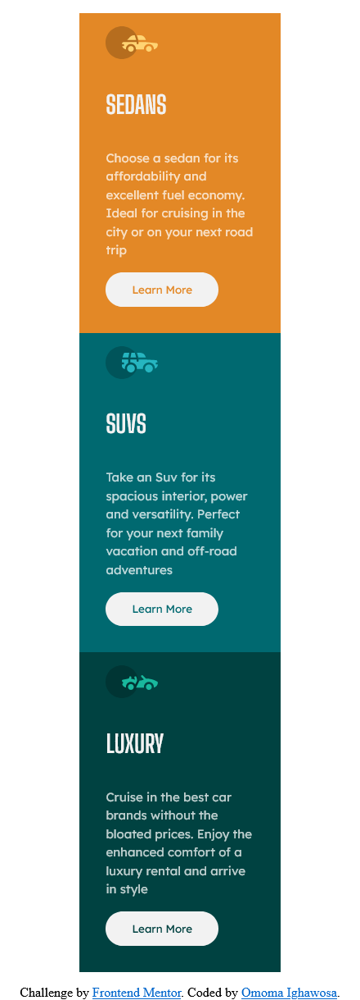

# Frontend Mentor - 3-column preview card component solution

This is a solution to the [3-column preview card component challenge on Frontend Mentor](https://www.frontendmentor.io/challenges/3column-preview-card-component-pH92eAR2-). Frontend Mentor challenges help you improve your coding skills by building realistic projects. 

## Table of contents

- [Overview](#overview)
  - [The challenge](#the-challenge)
  - [Screenshot](#screenshot)
  - [Links](#links)
- [My process](#my-process)
  - [Built with](#built-with)
  - [What I learned](#what-i-learned)
  - [Continued development](#continued-development)
- [Author](#author)

## Overview
In this project, I created a responsive 3-column preview card component using HTML and CSS. The component showcases different types of cars: sedans, SUVs, and luxury vehicles. Each card contains an image, a title, a description, and a "Learn More" button.

I utilized CSS flexbox and grid properties to create a clean and modern layout. The cards are styled with unique background colors to distinguish each car type. I selected suitable fonts from Google Fonts to enhance the typography and overall aesthetic of the component.

To ensure a responsive design, I implemented media queries to adjust the layout and styling for different screen sizes. This allows the component to adapt and display optimally on various devices, from mobile phones to larger screens.

Overall, this project challenged me to apply my HTML and CSS skills to create an attractive and functional 3-column preview card component. Through this process, I gained a deeper understanding of responsive design principles and how to create engaging user interfaces.

Feel free to check out my code and the live preview of the component. I'm excited to share my work and showcase my growth as a front-end developer.
### The challenge

Users should be able to:

- View the optimal layout depending on their device's screen size
- See hover states for interactive elements

### Screenshot



### Links

- Solution URL: [Add solution URL here](https://your-solution-url.com)
- Live Site URL: [Add live site URL here](https://your-live-site-url.com)

## My process
The process of creating the 3-column preview card component involved several steps. I followed a systematic approach to ensure an organized and efficient workflow. Here's a summary of the process:

1. Planning: I started by analyzing the project requirements and understanding the desired outcome. I gathered inspiration from existing designs and made a rough sketch of the component's structure and layout.

2. HTML Markup: I began coding the HTML structure of the component. I divided the content into three separate boxes, each representing a different car type. Within each box, I added the necessary elements such as images, headings, descriptions, and buttons.

3. CSS Styling: Once the HTML structure was in place, I focused on styling the component using CSS. I applied custom colors, fonts, and spacing to achieve the desired visual appearance. I utilized CSS flexbox and grid properties to create a responsive and flexible layout that adapts to different screen sizes.

4. Responsiveness: To ensure a seamless experience on various devices, I implemented responsive design techniques. I used media queries to adjust the layout, font sizes, and button styles based on the screen width. This allowed the component to look and function well on both desktop and mobile devices.

5. Testing and Refinement: I thoroughly tested the component across different browsers and devices to ensure its compatibility and responsiveness. I made necessary adjustments and refinements to fix any issues or inconsistencies that were identified during testing.

6. Documentation and Submission: Finally, I documented my code and prepared it for submission. I ensured that the code was clean, well-commented, and organized for easy readability. I also included appropriate file paths and external resources to ensure the project can be viewed and evaluated correctly.

Overall, the process involved careful planning, HTML markup, CSS styling, responsiveness implementation, testing, and documentation. This systematic approach allowed me to create a functional and visually appealing 3-column preview card component efficiently.

### Built with

- Semantic HTML5 markup
- CSS custom properties
- Flexbox
- CSS Grid
- Mobile-first workflow
- [Styled Components](https://styled-components.com/) - For styles


### What I learned
In the process of creating the 3-column preview card component, I gained valuable knowledge and learned several key concepts. Here's what I learned:

1. Semantic HTML Structure: I understood the importance of using semantic HTML tags to structure the content effectively. By choosing appropriate tags like <header>, <main>, <section>, and <footer>, I improved the accessibility and search engine optimization (SEO) of the component.

2. CSS Flexbox and Grid: I explored the power of CSS flexbox and grid layouts to create a responsive and flexible design. By using display: flex and display: grid properties, I easily aligned and positioned the elements within each box, allowing for a consistent and visually appealing layout.

3. Media Queries for Responsive Design: I implemented media queries to make the component responsive across different screen sizes. By applying specific CSS styles based on the viewport width, I ensured that the component adapts and displays optimally on both desktop and mobile devices.

4. Font and Color Customization: I learned how to incorporate custom fonts from Google Fonts by using the @import rule. I successfully applied the chosen fonts to headings and paragraphs, enhancing the overall visual appeal and readability of the component. Additionally, I discovered the importance of selecting appropriate color schemes to create a harmonious and visually pleasing design.

```html

<div class="box box1">
    <div class="content">
        
        <h1>SEDANS</h1>
        <p>
            Choose a sedan for its affordability and excellent
            fuel economy. Ideal for cruising in the city or on
            your next road trip
        </p>
        <button class="button button1">Learn More</button>
    </div>
</div>

```

### Continued development
Continuous development is vital for my growth as a web developer. Here are key strategies I employ:

1. Exploring New Technologies: Constantly learning and adapting to new web development tools and frameworks.

2. Engaging in Online Communities: Actively participating in developer forums and social media groups to learn from others.

3. Building Real-world Projects: Challenging myself with diverse projects to enhance problem-solving skills.

4. Seeking Feedback and Code Reviews: Actively seeking constructive criticism and code reviews to improve my coding practices.

4. Learning from Online Resources: Utilizing online platforms, tutorials, and courses to expand knowledge.

5. Attending Web Development Events: Participating in conferences and meetups to network and stay updated with industry trends.

Continuous development fuels my progress as a web developer, enabling me to refine my skills and stay ahead in a rapidly evolving field.

## Author
-   Website - [Omoma Ighawosa](https://ig-matrix.github.io/Lesson_3_Task_6_Omoma_Ighawosa/)
-   Frontend Mentor - [@Ig-Matrix](https://www.frontendmentor.io/profile/Ig-Matrix)
-   Twitter - [@I_am_ig_matrix](https://twitter.com/i_am_Ig_matrix)
